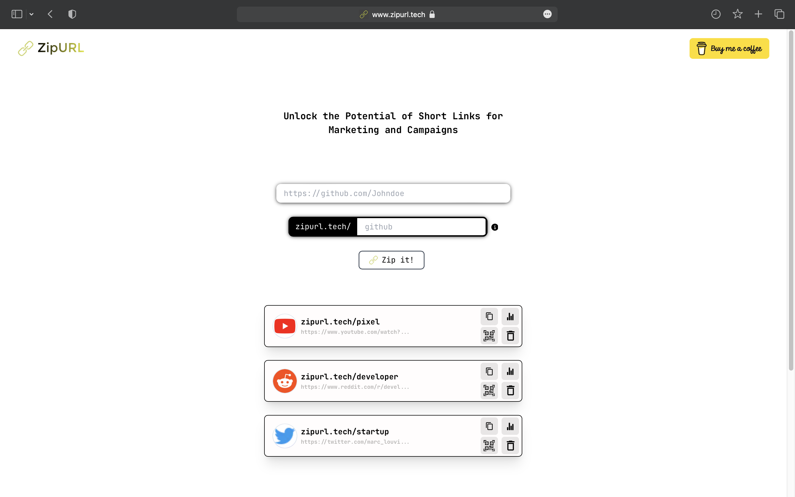

# ZipURL




[ZipURL](https://zipurl.tech/) is an application that allows users to shorten their links and customize the short links to make them more understandable and memorable. It provides a convenient way to manage and share shorter, more user-friendly URLs.


## Features

- Shorten URLs: Users can input long URLs and generate shorter, more concise links.
- Customizable short links: Users have the option to name their short links, making them more meaningful and easier to remember.
- Link management: Users can view and manage their shortened links and can delete them too.
- Analytics: Track the number of clicks for each shortened link.
- QR code generation: Generate QR codes for the shortened links for easy sharing and scanning.

## Installation

To use ZipURL, follow these steps:

1. Clone the repository from GitHub: [https://github.com/YugBhanushali/ZipURL](https://github.com/YugBhanushali/ZipURL)

2. Install the dependencies by running the following command in the project directory:
   ```shell
   npm install
   ```

3. Start the development server with the following command:
   ```shell
   npm run dev
   ```

4. Access the application by opening the following URL in your web browser:
   [https://zipurl.tech/](https://zipurl.tech/)

## Usage

1. Shortening a URL:
   - On the ZipURL homepage, enter the long URL that you want to shorten in the provided input field.
   - Before shortening your link you can suggest the name for your short link to make it more understandable and user friendly.
   - Click the "Zip it!" button. The application will generate a shortened link for you.

<!-- 2. Customizing a short link:
   - After generating a shortened link, you have the option to customize it.
   - Click the "Customize" button next to the shortened link.
   - Enter your desired custom name for the link.
   - Click the "Save" button. The link will be updated with your custom name. -->

3. Managing shortened links:
   - As user generate the short url all links are maintained at the homepage itself.
   - You will see a list of your shortened links, along with options delete them.

4. QR code generation:
   - To generate a QR code for a shortened link, click the "QR Code" button next to the link.
   - A QR code will be displayed, which you can download.

## Technologies Used

- Next.js: A React framework for server-rendered applications.
- Chakra UI: A component library for building user interfaces.
- Supabase: An open-source alternative to Firebase for backend services.
- TypeScript: A typed superset of JavaScript.
- Tailwind CSS: A utility-first CSS framework.
- QRCode.react: A QR code generator component for React.
- Other dependencies: lodash, nanoid, react-icons, react-loader-spinner, react-spinners, typewriter-effect, and more.

## Contributing

Thank you for considering contributing to ZipURL! If you have any suggestions, bug reports, or feature requests, please open an issue on the GitHub repository: [https://github.com/YugBhanushali/ZipURL](https://github.com/YugBhanushali/ZipURL)

## License

This project is licensed under the MIT License. See the [LICENSE](LICENSE) file for more information.

## Contact

If you have any questions or need assistance, feel free to contact the author:

- Name: Yug Bhanushali
- Email: yug.h.bhanushali1@gmail.com
- GitHub: [https://github.com/YugBhanushali](https://github.com/YugBhanushali)

Enjoy using ZipURL!